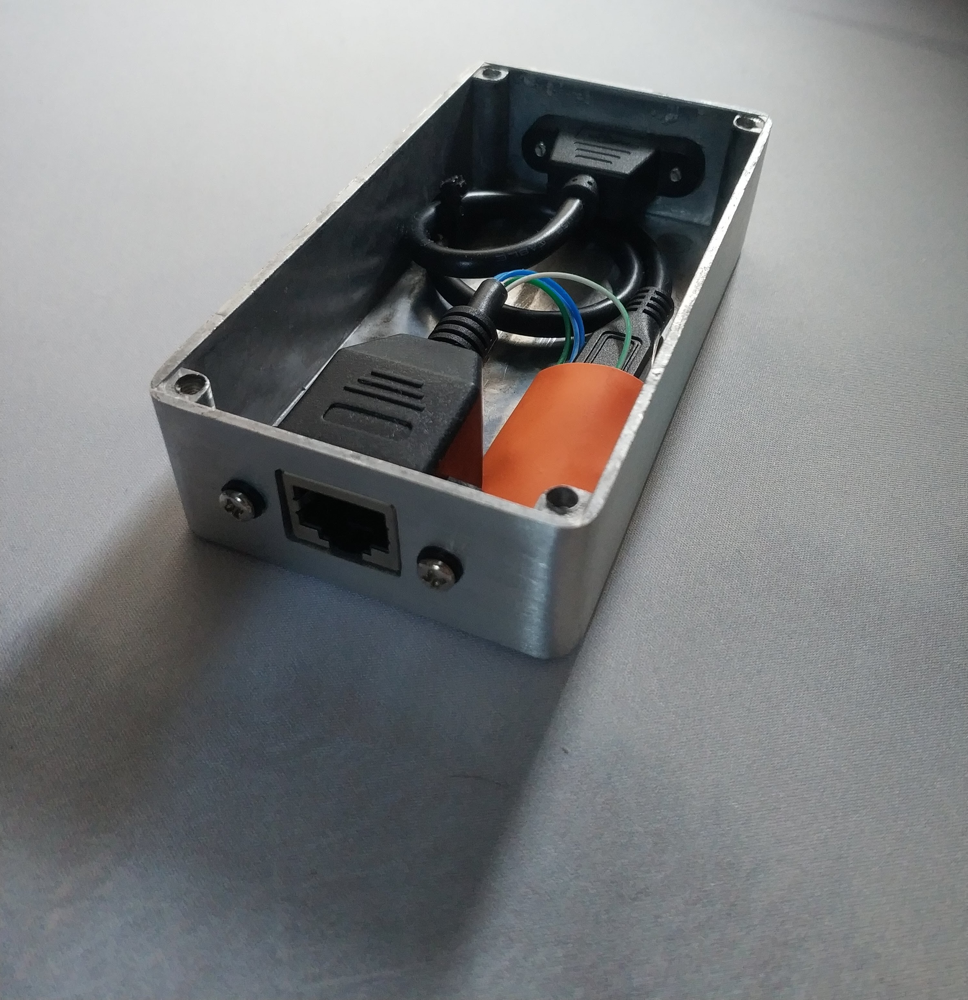

# Soarers Convertor-Build
Build log of an external Soarers Convertor 

The plan here is to use panel mount connectors for the input and output and connect them to an Arduino Pro Micro. 

## Step 1 Prep case and connectors


I cut two holes for the each panel mount connector and stripped down the RJ45 connector.

## Step 2 RJ45 


Next I buzzed through the connections through the IBM RJ45 cable to the panel mount connector. Here is what I connected the wires to. 

| IBM Cable | IBM board | Pro Micro | RJ45 Panel Mount|
|-----------|-----------|-----------|-----------------|
|     W     |   GND     |   GND     |       Gr        |
|   Black   |   VCC/5V  |   VCC     |      Gr/W       |
|    R      |   DATA    |   PD0     |      Blue       |
|    Y      |   ClOCK   |   PD1     |     Blue/W      |

## Step 3 Solder it up 


## Step 4 Get the files and flash the Pro Micro
https://geekhack.org/index.php?topic=17458.0
Once in bootloader mode I flashed the Pro Micro with the Soarer_at2usb_v1.0_atmega32u4.hex
```bash
avrdude -C”C:\Program Files (x86)”\Arduino\hardware\tools\avr\etc\avrdude.conf -v -p atmega32u4 -c avr109 -P COM4 -b 57600 -D -U flash:w:Soarer_at2usb_v1.0_atmega32u4.hex
```
## Step 5 Flash keymap 
I added scas and scwr to my Path variables to allow me to run them in Windows.
[My keymap file.](aholland.sc) 

scas is used to make a .scb from .sc. 
```
scas aholland.sc aholland.scb
```
Connect the Pro Micro and run,
```
scwr aHolland.scb
```

## Step 6 Put it together


